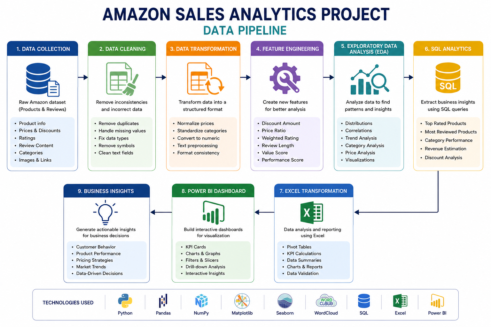

## 📌 Project Overview

This project focuses on analyzing an Amazon product sales dataset using a complete Data Analytics workflow.
The objective is to extract business insights, understand customer behavior, analyze product performance, and build interactive dashboards for decision-making.

The project combines:

- Data Cleaning
- Feature Engineering
- Exploratory Data Analysis (EDA)
- SQL Analytics
- Excel Data Transformation
- Power BI Dashboarding
---
## 🚀 Technologies Used

- Python
- Pandas
- NumPy
- Matplotlib
- Seaborn
- WordCloud
- SQL
- Excel
- Power BI
---
## 📂 Dataset Features

The dataset includes:

- Product Information
- Product Categories
- Pricing & Discounts
- Product Ratings
- Customer Reviews
- Product Images & Links

Main columns:

- product_id
- product_name
- category
- discounted_price
- actual_price
- discount_percentage
- rating
- rating_count
- review_content
- review_title
---
## 🧹 Data Cleaning

The following preprocessing steps were applied:

- Removed duplicates
- Handled missing values
- Converted prices and ratings to numeric format
- Cleaned currency symbols and special characters
- Standardized column formatting
---
## 🔧 Feature Engineering

New features were created to enhance analysis:

- Discount Amount
- Price Ratio
- Value Score
- Review Length
- Review Word Count
- Weighted Rating
- Sentiment Score
- Main Product Category

## 📊 Exploratory Data Analysis (EDA)

EDA was performed to discover trends and patterns.

- Visualizations Created
- Histograms
- Scatter Plots
- Pie Charts
- Donut Charts
- Heatmaps
- WordClouds
- Boxplots
- Key Analysis Areas
- Product Pricing Distribution
- Discount Analysis
- Category Performance
- Rating Distribution
- Customer Review Analysis
- Product Popularity
---
## 🗄️ SQL Analysis

SQL queries were used for business intelligence analysis:

- Top Rated Products
- Most Reviewed Products
- Category Performance
- Pricing Analysis
- Revenue Estimation
- Discount Insights
  
## Data PIPELINE

